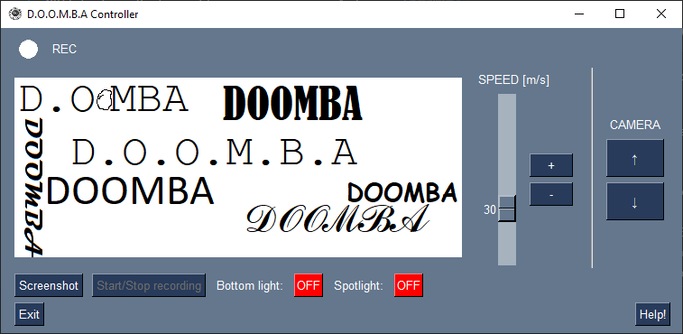

# 1 Software
## 1.1	Script mqtt_stream_publisher_arduino.py
Mqtt_stream_publisher_arduino.py je python script, určený ke spouštění na Raspberry Pi.
Jeho hlavními funkcemi jsou streamování videa z kamery a přeposílání příkazů z řídícího počítače do Arduina. Po přijetí příkazu se tento přeposílá po sériové lince Arduinu. Po celou dobu běhu se zároveň do terminálu vypisují doplňující informace jako jsou názvy použitých topics a čísla aktuálních snímků. Při spouštění je potřeba jako parametry doplnit ip adresu brokeru a COM port Arduina. To je podrobněji vysvětleno v kapitole Spuštění scriptu na Raspberry Pi.

## 1.2  Script mqtt_stream_reciever.py
Python script určený pro spouštění na řídícím počítači.
Program vytváří okno aplikace D.O.O.M.B.A Controller, která podle stisknutých kláves nebo tlačítek odesílá příkazy přes MQTT. Zároveň v okně zobrazuje video přicházející z robotu.
## 1.3	Arduino firmware cmd_reciever.ino
Program nahraný na Arduino Nano.
Díky tomuto programu komunikuje Arduino po sériové lince s Raspberry Pi a dostává tak příkazy. Podle příkazů potom přes H-můstek řídí motory pohonu, servomotor otáčející kamerou a LED diody.

# 2	Obsluha
## 2.1	První použití
Před prvním použitím robotu je potřeba zjistit, jestli je v Raspberry Pi vložená SD karta s operačním systémem. Pokud není, je potřeba podle [tohoto](https://www.tomshardware.com/reviews/raspberry-pi-headless-setup-how-to,6028.html) článku na SD kartu nahrát operační systém, vložit ji do Raspberry Pi a spustit ho. Při nastavování operačního systému je potřeba dbát na několik věcí: \
•	Zvolit vhodný operační systém. Standartě se používá operační systém Raspbian, který se dá používat ve verzi s GUI (grafickým uživatelským rozhraním) nebo bez něj. Já jsem volil plnou verzi s uživatelským rozhraním, protože je přístupnější pro začátečníky, a hodně se podobá vzhledu operačního systému Windows. Další postup zároveň s touto verzí počítá.\
•	V jednom z kroků je možnost konfigurace LAN sítě, ke které se má Raspberry Pi po spuštění připojit. Osvědčilo se mi použít hotspot vytvářený řídícím počítačem, protože je potom možné se k Raspberry Pi jednoduše připojit, ať už jsme v jakékoli síti. \
•	Je potřeba povolit připojování přes SSH Secure Shell aby bylo možné připojit se k terminálu Raspberry Pi z řídícího počítače. \
•	Nastavit název, pod kterým se zařízení bude objevovat v síti. Parametr hostname nastavit třeba na „raspi“.  Zároveň zvolit jméno uživatele, např. „user“ a heslo.
Že se vše podařilo správně nastavit a Raspberry Pi se úspěšně připojilo k hotspotu řídícího počítače můžeme ověřit ve Windows terminálu pomocí příkazu: \
```ping user@raspi -t``` \
 Po zadání tohoto příkazu zašle počítač krátké síťové zprávy, nazývané "pingy", na danou adresu a čeká na odpověď. Pokud je zařízení dostupné, vrátí odpověď, což naznačuje správné připojení.

## 2.2	Spuštění aplikace na řídícím počítači
K řízení robotu potřebujeme aplikaci, dostupnou z veřejného [repositáře](https://github.com/kuceram2/doomba). Všechny soubory je potřeba stáhnout jako .ZIP a extrahovat. Pro spuštění je potřeba nainstalovat na počítač [Python](https://www.python.org/downloads/windows/), v terminálu změnit pracovní umístění do extrahované složky a spustit příkaz: \
```pip install .\requirementsWindows.txt -r```
 
Tím se nainstalují všechny závislosti potřebné pro běh aplikace.  Také je potřeba nainstalovat a spustit Mosquitto broker (5.2) podle přiloženého [návodu](https://cedalo.com/blog/how-to-install-mosquitto-mqtt-broker-on-windows/).
Když je broker spuštěn, v terminálu v umístění extrahované složky spustíme aplikaci příkazem: \
 ```python .\mqtt_stream_receiver.py localhost``` \
Parametr localhost určuje ip adresu MQTT brokeru. Pokud příkaz vrátí chybu TimeoutError: timed out, znamená to, že broker není spuštěný nebo se k němu nepodařilo připojit.
Pokud vše proběhlo správně, mělo by se zobrazit okno aplikace. Její funkce jsou vysvětleny níže.

## 2.3 Zprovoznění Arduino Nano
Pokud není na Arduino nahrán potřebný program, je potřeba to  udělat. Nejjednodušší je připojit Arduino k řídícímu počítači a přes Arduino IDE nahrát program cmd_reciever.ino, obsažený ve dříve stažené složce. Následně podle schématu v souboru zapojení.fzz připojit všechny vodiče a Arduino samotné k Raspberry Pi.

## 2.4	Příprava robotu k provozu
Před Spuštěním scriptu na Raspberry Pi je potřeba zkontrolovat, jestli je hardware robotu v pořádku a připraven k běhu. Je potřeba zkontrolovat:
•	Připojení baterie napájející motory a její nabytí. Baterie je uložena ve slotu v horní polovině těla robotu. Baterie musí být přes kolébkový přepínač na spodku robotu připojena ke vstupu H-můstku (3.3) a ten musí být v poloze „1“.\
•	Připojení Raspberry Pi k powerbance.\
•	Připojení Arduino Nano k Raspberry Pi přes USB.\
•	Zda nejsou nějaké vodiče uvolněné nebo odpojené. Pokud ano, je potřeba je zapojit zpět podle schématu v [zapojeni.fzz](zapojeni.fzz).

## 2.5	Spuštění scriptu na Raspberry Pi
Z hlavního počítače se můžeme k Raspberry Pi připojit přes SSH nebo vzdálenou plochu. Tento návod dále uvažuje pouze použití SSH.
Připojení provedeme pomocí příkazu ve Windows terminálu: \
```ssh user@raspi``` \
Zadáme heslo a získáme tak přístup k terminálu jako běžný uživatel.
Potřebné soubory stáhneme příkazem: \
```git clone https://github.com/kuceram2/doomba.git```

Změníme umístění do stažené složky a nainstalujeme potřebné závislosti: \
```pip install .\requirementsUbuntu.txt -r```

Následně spustíme script: \
```python ./mqtt_stream_publisher.py  "ip_adresa" "arduino_port"```
 
Parametry ‚ip_adresa‘ a ‚arduino_port‘ je potřeba doplnit skutečnými hodnotami. Jako ip adresu dosadíme adresu řídícího počítače, na kterém běží MQTT broker. Port, na kterém je připojené Arduino se dá zjistit podle přiloženého [článku](https://cedalo.com/blog/how-to-install-mosquitto-mqtt-broker-on-windows/).
Script začne přenášet data z kamery a přijímat příkazy z řídícího počítače. Ukončit ho můžeme stiskem ctrl+c.

## 2.6	Aplikace D.O.O.M.B.A Controller
Po spuštění aplikace se zobrazí okno s obrázkem a tlačítky, jejichž funkce jsou zde vysvětleny.


•	Pohyb robota je řízen klávesami W, A, S, D.\
•	Rychlost motorů lze nastavit posuvníkem, tlačítky, nebo klávesami X a C.\
•	Tlačítkem „Screenshot“ nebo klávesou F lze uložit aktuální zobrazený snímek z kamery.\
•	Tlačítky pod nápisem „CAMERA“, nebo klávesami N a M se upravuje natočení kamery nahoru a dolů.\
•	Tlačítka „Bottom light“ a „Spotlight“ vypínají a zapínají LED diody umístěné u kamery a na podvozku robotu. Stejnou funkci mají i klávesy E a R.\
•	Po spuštění programu na Raspberry Pi se místo obrázku začne přehrávat video z kamery na robotu.
•	Aplikaci lze ukončit tlačítkem „Exit“ nebo klávesou P.